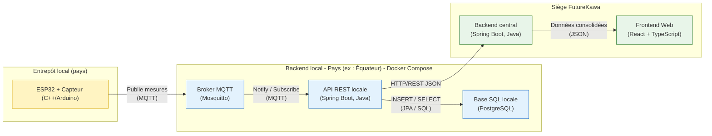
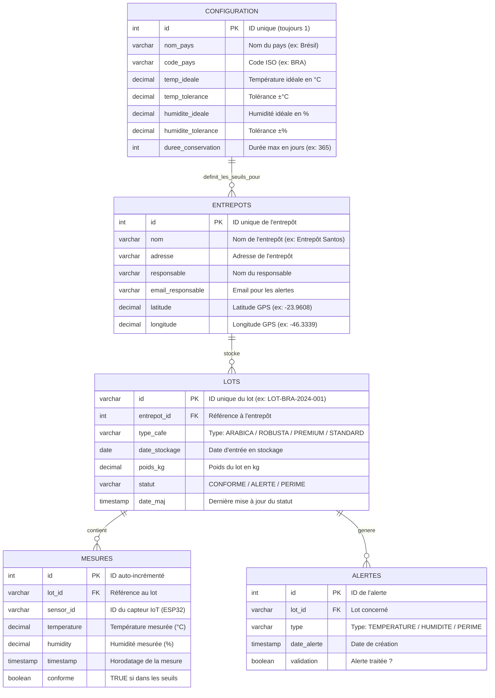

## Hi there 👋
# ☕ FutureKawa - IoT & Coffee Monitoring System

> **Solution de surveillance distribuée (IoT) et centralisée pour la traçabilité du stockage de café vert.**
> *Projet réalisé dans le cadre de la MSPR - Bloc 4 (Concevoir et développer des solutions applicatives).*

---

## 🌍 Contexte du Projet

**FutureKawa** est une entreprise internationale de caféiculture (Brésil, Équateur, Colombie).
**Problème :** Pertes de qualité dues à des conditions de stockage mal maîtrisées (température/humidité) et manque de traçabilité.
**Solution :** Un système distribué complet permettant de :
1. **Collecter** en temps réel les données environnementales via des capteurs IoT (ESP32).
2. **Stocker** localement les données dans chaque pays (Brésil, Équateur, Colombie).
3. **Consolider** les stocks et les alertes au siège via une architecture centralisée.

---

## 👥 L'Équipe Projet

| Membre | Rôle Principal | Responsabilités Clés |
| :--- | :--- | :--- |
| **FATHALLAH Ayoub** | -- | -- |
| **COPPIN Mattheo** | -- | -- |
| **BOUNOUR Zied** | -- | -- |
| **GNINGUE Papa Cheikh** |-- | -- |

---

## 🏗️ Schéma d'Architecture Globale

### 🛠️ Stack Technologique
*   **IoT :** ESP32, Capteurs DHT22, C++ (Arduino Core)
*   **Communication :** MQTT (Mosquitto)
*   **Backend :** Java Spring Boot (API REST)
*   **Base de Données :** PostgreSQL
*   **Frontend :** React.js + TypeScript
*   **DevOps :** Docker, Docker Compose, Jenkins

---

## 💾 Base de Données

Chaque pays dispose de sa propre base de données locale **PostgreSQL** pour garantir l'autonomie en cas de coupure réseau.

### Modèle Relationnel (MCD)
La structure respecte la hiérarchie : **Configuration → Entrepôts → Lots → Mesures/Alertes**.

